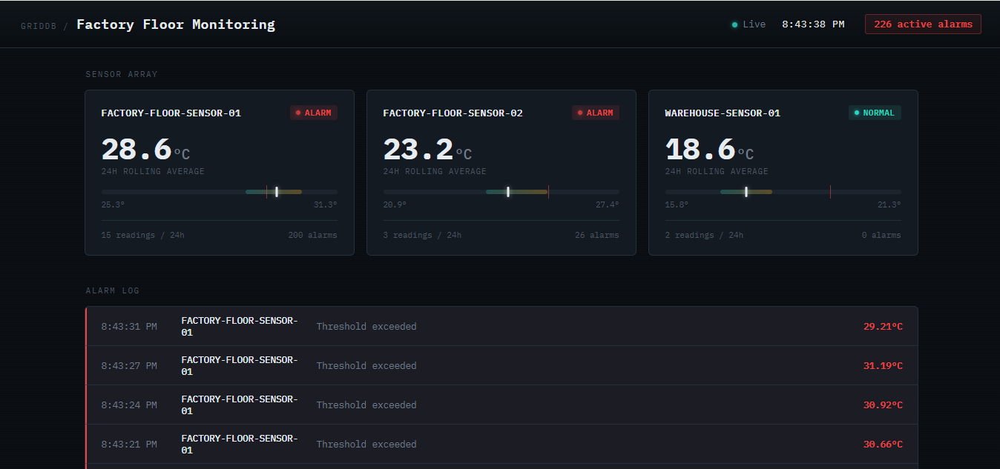
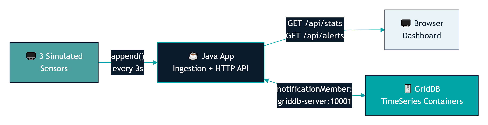

# GridDB Dashboard for Factory Floor Monitoring

A production-inspired Java application that demonstrates how to build a real-time Industrial IoT monitoring dashboard using **GridDB**, **Docker**, and **Java 17**.

The application simulates factory sensor data, stores it in GridDB's native **TimeSeries** containers, exposes a lightweight REST API, and visualizes live metrics through a browser-based dashboard. Everything runs inside Docker Compose, making the project easy to deploy on Windows, macOS, and Linux.

> **Companion project for the blog:**  
> **Building a Real-Time GridDB Dashboard for Factory Floor Monitoring**

---

## Features

- Native **GridDB TimeSeries** storage for sensor data
- Java 17 application using the **official GridDB Java Client**
- Simulated Industrial IoT sensor data generation
- Historical data seeding and continuous live ingestion
- Embedded REST API using Java's built-in `HttpServer`
- Real-time monitoring dashboard
- Live statistics (Average, Minimum, Maximum)
- Threshold-based alert detection
- Cross-platform deployment with Docker Compose
- Production-oriented configuration using environment variables


---

## Architecture

```
                 Simulated Sensors
                        │
                        ▼
              Java Data Ingestion Service
                        │
                        ▼
          GridDB TimeSeries Containers
                        │
                        ▼
             Embedded REST API Server
                        │
                        ▼
           Real-Time Web Dashboard
```

The application consists of four primary components:

1. **Sensor Simulator** generates live factory sensor readings.
2. **GridDB** stores readings inside native TimeSeries containers.
3. **REST API** provides statistics, alerts, and historical data.
4. **Dashboard** visualizes live sensor information in the browser.

---

## Screenshots

### Dashboard




### Architecture




---

# Technology Stack

- Java 17
- Maven
- GridDB
- Docker
- Docker Compose
- HTML5
- JavaScript
- Chart.js

---

# Project Structure

```
griddb-dashboard-demo/
├── docker-compose.yml
├── README.md
├── app/
│   ├── Dockerfile
│   ├── pom.xml
│   └── src/main/
│       ├── java/com/example/griddb/
│       │   ├── Main.java
│       │   ├── GridDbConnection.java
│       │   ├── SensorReading.java
│       │   ├── SensorIngestor.java
│       │   └── DashboardServer.java
│       └── resources/
│           └── dashboard.html
└── images/
    ├── architecture.png
    ├── dashboard-screenshot.png
    ├── device-panel-closeup.png
    ├── docker-compose-terminal.png
    └── docker-containers-running.png
```

---

# Prerequisites

Install the following software before running the project:

- Docker Desktop
- Docker Compose v2
- Git

Java 17 and Maven are only required if you intend to build or modify the application outside Docker.

---

# Quick Start

Clone the repository.

```bash
git clone https://github.com/dagmawit-sudo-cloud/griddb-dashboard-demo.git
cd griddb-dashboard-demo
```

Build and start the application.

```bash
docker compose up --build
```

After startup, open your browser and navigate to:

```
http://localhost:8080
```

The dashboard will begin displaying live sensor readings within a few seconds.

---

# How It Works

When the application starts, it performs the following workflow:

1. Creates GridDB TimeSeries containers for each simulated device.
2. Seeds approximately **100 historical sensor readings** per device.
3. Starts a background ingestion thread for each device.
4. Appends new readings every **3 seconds**.
5. Calculates live statistics using GridDB aggregation functions.
6. Detects threshold violations.
7. Serves data through REST endpoints.
8. Updates the dashboard every **5 seconds**.

---

# REST API

| Endpoint | Description |
|----------|-------------|
| `GET /` | Dashboard |
| `GET /api/health` | Application health check |
| `GET /api/stats` | Device statistics (AVG, MIN, MAX, count) |
| `GET /api/alerts` | Recent threshold alerts |
| `GET /api/history?device=<id>` | Historical readings for a device |

---

# Dashboard Features

The dashboard provides a real-time operational view of the simulated factory floor.

Features include:

- Fleet-wide summary
- Live device status
- Temperature trend charts
- Historical sparkline visualization
- Min/Max range indicators
- Threshold alert log
- Automatic refresh every 5 seconds
- Connection status monitoring

---


# Configuration

The following optional environment variables can be configured.

| Variable | Description |
|----------|-------------|
| `DASHBOARD_PORT` | HTTP server port |
| `GRIDDB_ANALYSIS_WINDOW_HOURS` | Statistics time window |
| `GRIDDB_ALERT_THRESHOLD` | Temperature alert threshold |

Default values are suitable for running the demonstration without modification.

---

# Troubleshooting

## Dashboard does not load

Verify both Docker containers are running.

```bash
docker ps
```

---

## Port 8080 is already in use

Modify the port mapping inside `docker-compose.yml`.

Example:

```yaml
ports:
  - "8090:8080"
```

Then access:

```
http://localhost:8090
```

---

## GridDB connection fails during startup

GridDB may require 30–60 seconds to initialize.

The application automatically retries the connection until the database becomes available.

---

## Container name conflict

If another GridDB demo is already running:

```bash
docker stop griddb-server
docker rm griddb-server

docker stop griddb-java-app
docker rm griddb-java-app
```

---

# Blog Article

This repository accompanies the tutorial:

**Building a Real-Time GridDB Dashboard for Factory Floor Monitoring**

The article explains the complete architecture, implementation details, and design decisions behind this project.

---

# References

- GridDB Java Client Documentation  
  https://www.griddb.net/en/resources/griddb-java-api-reference/

- GridDB GitHub Repository  
  https://github.com/griddb/griddb

- Docker Documentation  
  https://docs.docker.com/

- Chart.js Documentation  
  https://www.chartjs.org/docs/latest/

---
